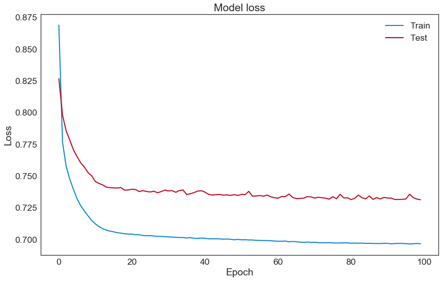

# Credit Card Fraud Detection using AutoEncoders

This repository contains the implementation and evaluation of an AutoEncoder neural network model for the purpose of detecting fraudulent transactions on credit card data.

## Model Evaluation and Results

The following visuals demonstrate the analysis and performance of the AutoEncoder model:

### Confusion Matrix

### Reconstruction Error

### Recall vs Precision

### ROC Curve

### Model Loss During Training

### Precision and Recall for Different Threshold Values

---

Please explore the notebooks and scripts provided in this repository to understand the data preparation, model building, and evaluation processes.
